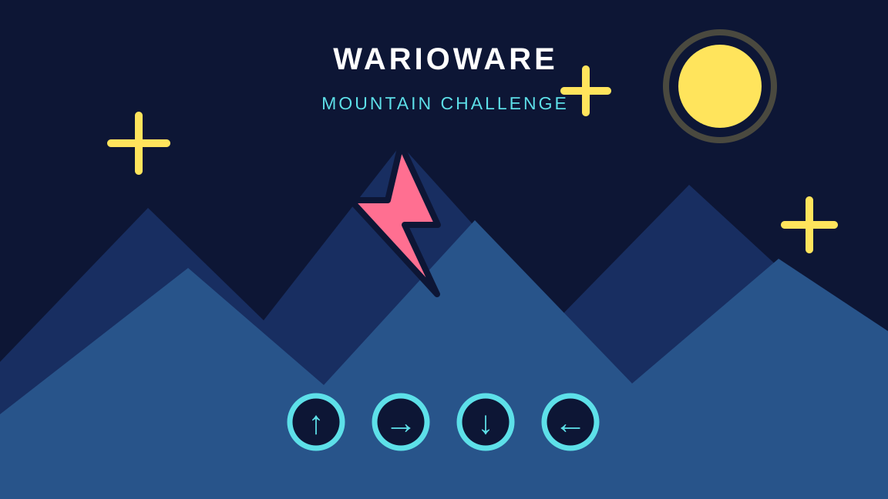

# The Best Wario Game Ever Made

A fast four-round WarioWare-style challenge where every second counts on the climb to the summit.

## Try it

**[Play the browser demo on itch.io](https://steff11.itch.io/the-best-wario-game-ever-made)**

## Quick start

1. Open the demo link above.
2. Choose **Start Game**.
3. Complete all four timed minigames before losing all five lives.

For the local Godot version, open `thebest-wariogameevermade/project.godot` in Godot 4.7 or newer and press **Play**. No extra libraries or downloads are required.

## Features

- A platformer round with a 1.7× jump boost, three garlic targets, and on-screen controls.
- A timed garlic-clicking round with four targets.
- A moving star-catching round that rewards quick mouse clicks.
- A direction-signal round that accepts arrow keys or matching on-screen buttons.
- A five-life system, countdown transitions, replay flow, original winner scene, and original death scene.
- A responsive HTML5 export that runs directly in the browser.

## How it works

Each round is a separate Godot scene with a small script that owns its timer, input handling, progress, and success/failure result. The transition scene keeps the four-round sequence readable: it updates the level counter, shows the remaining lives, and launches the next scene. A failed round costs one life and retries that round after the transition; completing round four opens the winner scene.

The new Signal Summit round uses a fixed directional pattern so the challenge is predictable and testable. The same action functions are called by both keyboard input and the four mouse buttons, keeping the two control paths consistent.

## Controls

- Platformer: **A/D** or **Left/Right** to move; **W**, **Space**, **Enter**, or **JUMP** to jump.
- Other rounds: click the targets directly.
- Signal Summit: press **Up**, **Right**, **Down**, or **Left**, or click the matching button.
- Open **Settings** from the title screen for the in-game reminder.

## Assets and credits

- The mountain background and the existing winner/death artwork are project-provided assets retained in the game.
- The key art, garlic targets, and summit runner in `assets/game2-key-art.svg`, `assets/garlic-target.svg`, and `assets/player.svg` are original vector illustrations created for this project.
- The Signal Summit interface uses original layout, color, and arrow artwork built in the Godot scene.
- Built with [Godot](https://godotengine.org/).

## Mission checklist

- Godot project: yes.
- Four input-responsive minigames: yes.
- Original winner and death scenes: yes.
- Self-made visual assets: key art, garlic targets, summit runner, and Signal Summit interface included.
- README: this file includes a hero image, demo link, quick start, features, local run instructions, technical overview, controls, and credits.
- Coding time: record and submit your real coding time; this README does not claim hours that were not worked.
- AI use: this session provided implementation assistance, so do not submit it as zero-AI work. Review the code and disclose assistance honestly if the mission asks.

## Links

- [Play the browser demo](https://steff11.itch.io/the-best-wario-game-ever-made)
- [GitHub repository](https://github.com/costachestefy90-source/WarioGame)
- [Raw README URL](https://raw.githubusercontent.com/costachestefy90-source/WarioGame/main/README.md)
